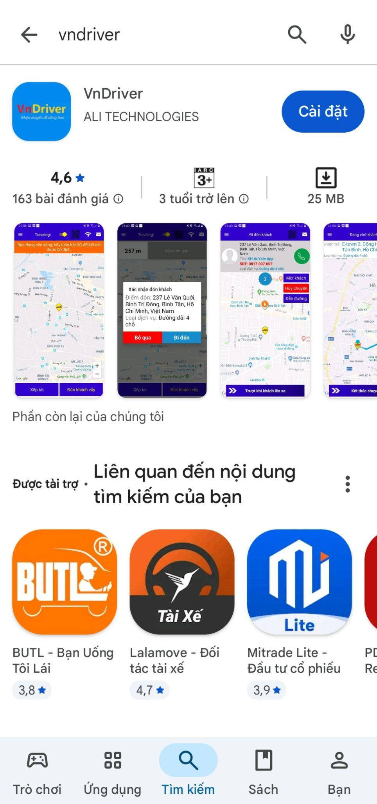
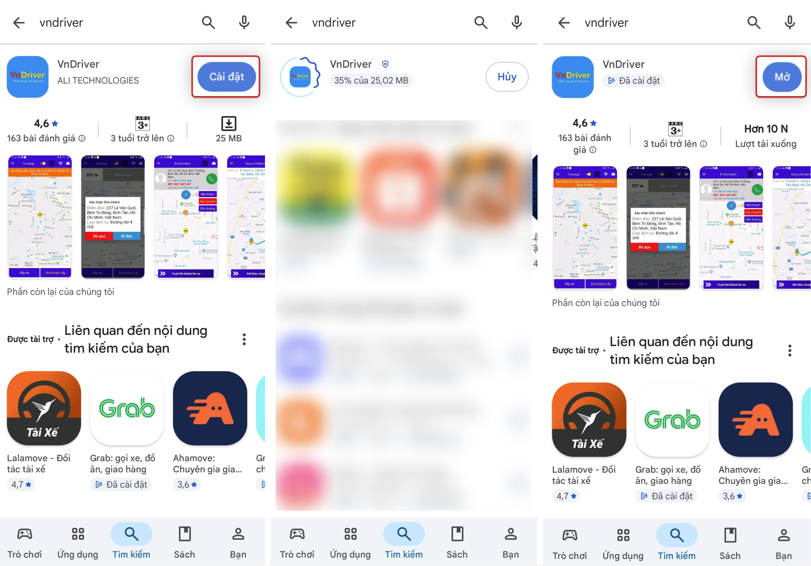
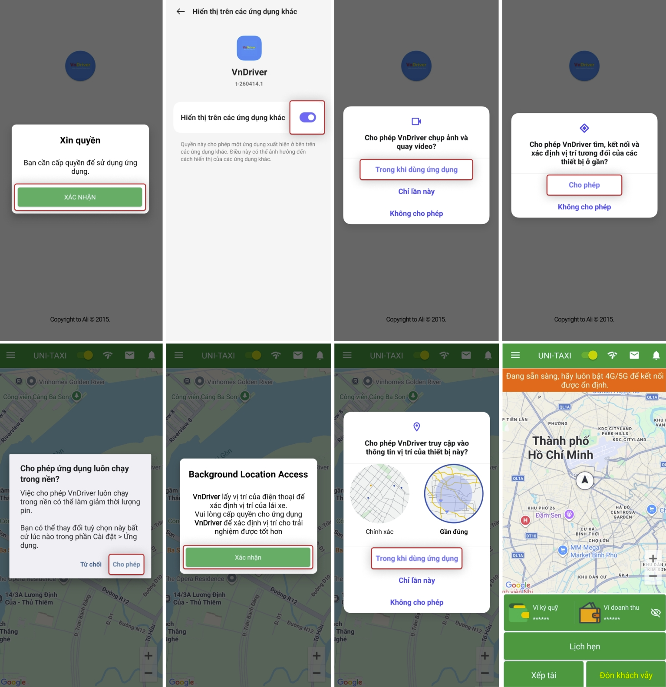

# Cài đặt App VNDriver

Hướng dẫn tải và cài đặt App VNDriver trên điện thoại.

## Yêu cầu

-   Điện thoại thông minh (Smartphone)
-   Kết nối Internet (Wi-Fi hoặc 3G/4G/5G)

/// tab | Android
1. Mở **CH Play** (Google Play Store) trên điện thoại.
2. Tìm kiếm **"vndriver"**.

    {: loading=lazy }

3. Chọn ứng dụng **VNDriver**, sau đó chọn **Cài đặt**.

    {: loading=lazy }

4. Đợi quá trình tải và cài đặt hoàn tất.
5. Chọn **Mở** để khởi động App.
///

/// tab | iOS
1. Mở **App Store** trên iPhone.
2. Tìm kiếm **"vndriver"**.
3. Chọn **Nhận** (Get).
4. Xác nhận bằng Face ID / Touch ID / mật khẩu Apple ID.
5. Đợi quá trình tải và cài đặt hoàn tất.
6. Chọn **Mở** để khởi động App.
///

## Cấp quyền ứng dụng (lần đầu mở App)

Khi mở App lần đầu, ứng dụng sẽ yêu cầu một số quyền:

{: loading=lazy }

| Quyền | Mục đích |
|---|---|
| **Vị trí (GPS)** | Xác định vị trí tài xế, nhận chuyến phù hợp |
| **Lưu trữ / Ảnh** | Chụp ảnh, gửi hình ảnh hỗ trợ |
| **Thông báo** | Nhận thông báo chuyến mới, tin nhắn |

!!! warning "Quan trọng"
    - **Quyền vị trí (GPS)** là bắt buộc để App hoạt động. Nếu từ chối, bạn sẽ không thể nhận chuyến.
    - Cài đặt quyền: bật **Luôn luôn** cho phép truy cập vị trí.
    - **Tắt** tạm dừng hoạt động nếu không dùng để đảm bảo ứng dụng chạy nền ổn định.

## Kiểm tra lại cấp quyền

Vào **Cài đặt điện thoại → Ứng dụng → VNDriver → Quyền** để kiểm tra:

-   Vị trí: **Luôn luôn** (Allow all the time)
-   Thông báo: **Đã bật**
-   Tối ưu pin: **Không tối ưu** / **Không giới hạn**
