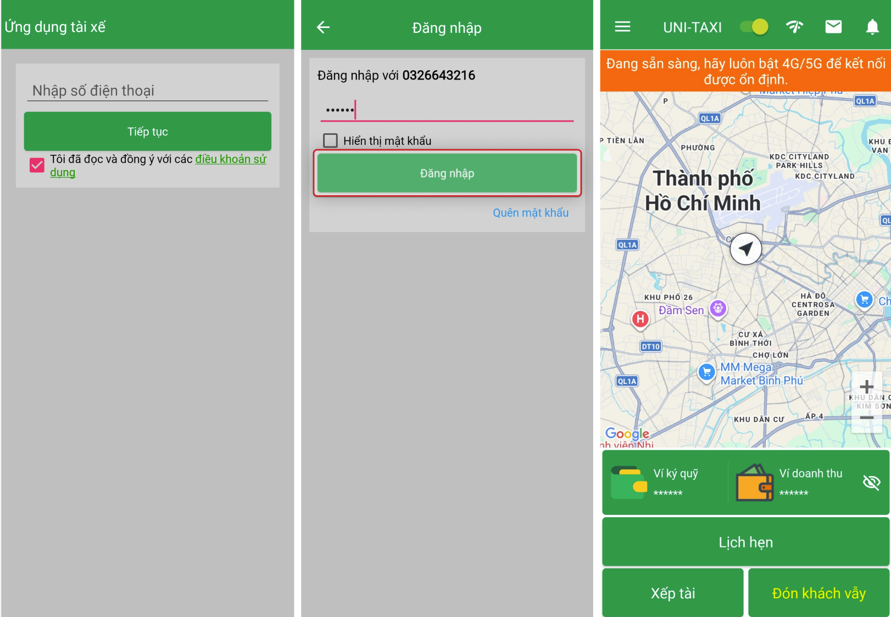
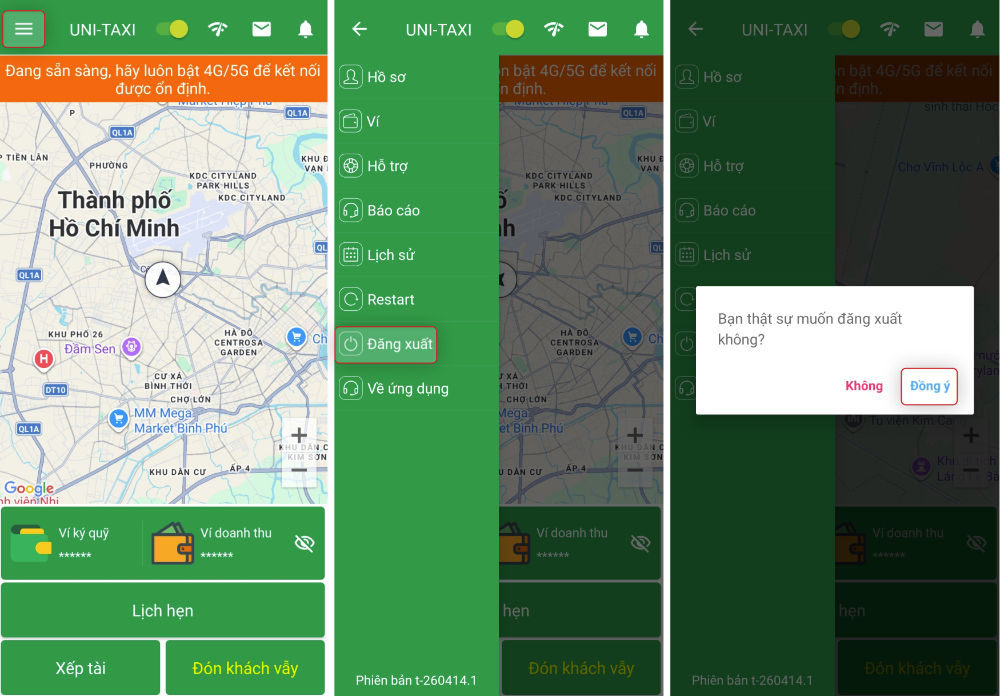

# Đăng nhập & Đăng xuất

## Đăng nhập

1. Mở App VNDriver.
2. Nhập **tài khoản** và **mật khẩu** đã được cấp.

    {: loading=lazy }

3. Chọn **Đăng nhập**.
4. Sau khi đăng nhập thành công, App chuyển đến màn hình sẵn sàng đón khách.

!!! tip "Mẹo"
    Đánh dấu **Ghi nhớ đăng nhập** để lần sau không cần nhập lại mật khẩu.

## Đăng ký tài khoản mới

Nếu chưa có tài khoản, chọn **Đăng ký** trên màn hình đăng nhập:

1. Nhập số điện thoại.
2. Nhập mã xác thực (OTP) được gửi qua SMS.
3. Tạo mật khẩu (tối thiểu 6 ký tự).
4. Xác nhận mật khẩu.
5. Hoàn tất đăng ký.

## Quên mật khẩu

1. Trên màn hình đăng nhập, chọn **Quên mật khẩu**.
2. Nhập số điện thoại đã đăng ký.
3. Nhập mã OTP được gửi qua SMS.
4. Tạo mật khẩu mới.
5. Xác nhận mật khẩu mới.
6. Đăng nhập với mật khẩu mới.

## Đăng xuất

1. Ở màn hình sẵn sàng đón khách, chọn **dấu 3 gạch** (☰) ở góc trái màn hình.
2. Chọn **Đăng xuất**.
3. Xác nhận đăng xuất.

    {: loading=lazy }

!!! warning "Lưu ý"
    - Không chia sẻ mật khẩu với người khác.
    - Đăng xuất khi sử dụng thiết bị dùng chung.
