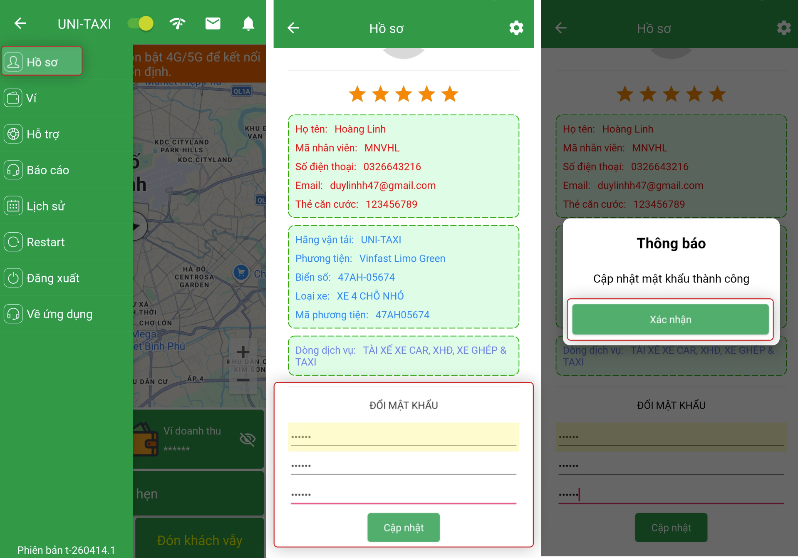
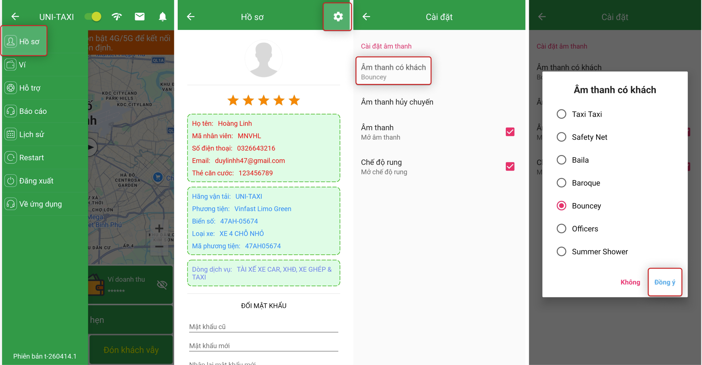

# Hồ sơ cá nhân & Cài đặt

Xem và chỉnh sửa thông tin cá nhân, đổi mật khẩu, cài đặt âm thanh trên App VNDriver.

## Cách truy cập

1. Mở App VNDriver.
2. Chọn **dấu 3 gạch** (☰) ở góc trái màn hình.
3. Chọn **Hồ sơ**.

## Thông tin hiển thị

| Mục | Mô tả |
|---|---|
| **Ảnh đại diện** | Hình ảnh của tài xế |
| **Họ và tên** | Tên đầy đủ đã đăng ký |
| **Số điện thoại** | Số điện thoại đăng nhập |
| **Email** | Địa chỉ email (nếu có) |
| **Ngày tham gia** | Ngày đăng ký tài khoản |

## Chỉnh sửa thông tin

1. Chọn biểu tượng **Sửa** (bút/chỉnh sửa) cạnh thông tin muốn thay đổi.
2. Nhập thông tin mới.
3. Chọn **Lưu**.

## Đổi mật khẩu

Vào mục **Hồ sơ** để cập nhật thông tin và đổi mật khẩu.

{: loading=lazy }

1. Chọn **Đổi mật khẩu**.
2. Nhập **Mật khẩu cũ**.
3. Nhập **Mật khẩu mới** (tối thiểu 6 ký tự).
4. Xác nhận **Mật khẩu mới**.
5. Chọn **Lưu**.

!!! info "Lưu ý"
    - **Số điện thoại** là thông tin đăng nhập và không thể thay đổi qua App — liên hệ hỗ trợ nếu cần.
    - Một số thông tin cần xác thực trước khi thay đổi.

## Cài đặt âm thanh App

Cài đặt âm thanh thông báo có khách và hủy chuyến:

{: loading=lazy }

-   **Âm lượng thông báo**: điều chỉnh âm lượng khi có chuyến mới.
-   **Âm lượng hủy chuyến**: điều chỉnh âm lượng khi chuyến bị hủy.
-   **Tùy chọn rung**: bật/tắt rung khi có thông báo.
