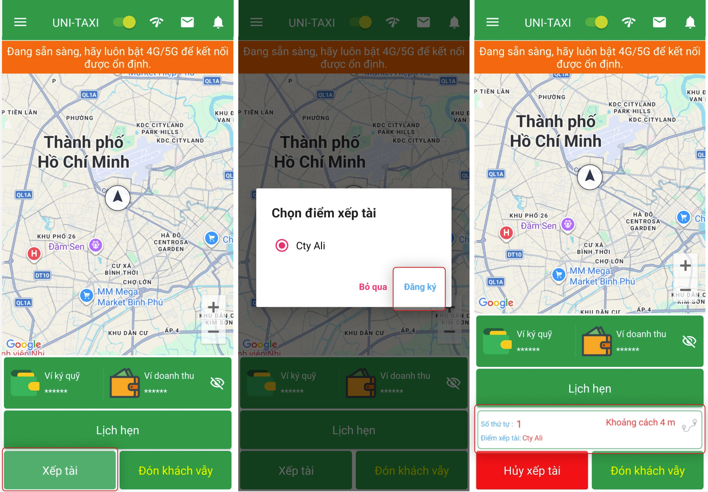
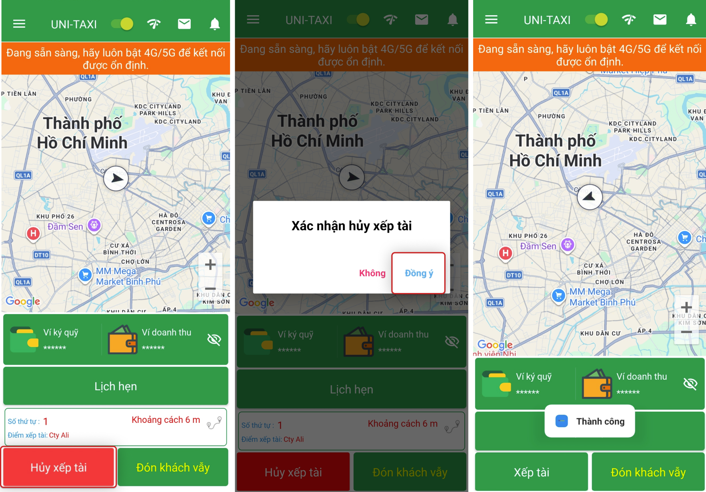

# Xếp tài (Xếp hàng chờ)

Khi tài xế đến một địa điểm tiếp thị cho phép xếp tài, có thể chọn xếp tài trên ứng dụng. Khi có giao dịch từ điểm xếp tài, hệ thống sẽ ưu tiên phân phối cho tài xế đang xếp tại điểm đó.

## Bật xếp tài

1. Trên màn hình chính, chọn tính năng **Xếp tài**.
2. Hệ thống sẽ đưa bạn vào hàng chờ tại điểm tiếp thị.

    {: loading=lazy }

!!! info "Cơ chế hoạt động"
    - Khi có chuyến phù hợp tại điểm xếp tài, chuyến sẽ được ưu tiên cho tài xế đang xếp hàng chờ (theo thứ tự).
    - Thứ tự ưu tiên dựa trên: thời gian xếp hàng + khoảng cách đến điểm đón.
    - Nếu rời khỏi khu vực, bạn có thể bị loại khỏi hàng chờ.

## Hủy xếp tài

1. Chọn **Hủy xếp tài** trên màn hình.

    {: loading=lazy }

2. Xác nhận hủy.

## Lưu ý

-   Chỉ nên bật xếp tài khi đang ở trong khu vực có nhu cầu cao.
-   Xếp tài không đảm bảo 100% sẽ có chuyến — phụ thuộc vào nhu cầu thực tế.
-   Có thể bật/tắt xếp tài bất kỳ lúc nào.
