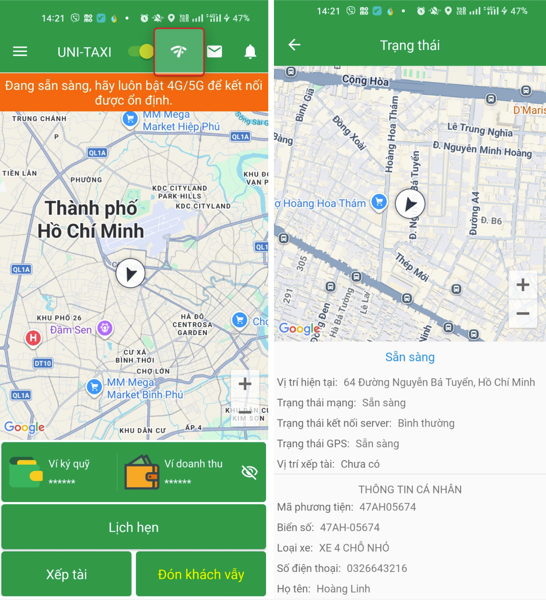

# Kiểm tra trạng thái hoạt động

## Các trạng thái

| Trạng thái | Mô tả |
|---|---|
| **Online** | Sẵn sàng nhận chuyến. App sẽ gửi thông báo khi có chuyến mới. |
| **Offline** | Tạm nghỉ, không nhận chuyến. Không có thông báo chuyến mới. |
| **Đang chạy** | Đang thực hiện chuyến (đón khách → hoàn thành). |

## Kiểm tra trạng thái App

Tài xế có thể kiểm tra trạng thái của App bằng cách chọn biểu tượng **trạng thái** trên màn hình.

{: loading=lazy }

Màn hình chi tiết trạng thái hiển thị các thông tin:

-   Kết nối Internet
-   Kết nối GPS
-   Trạng thái Online/Offline
-   Phiên bản App

    {: loading=lazy }

## Chuyển đổi Online / Offline

Có 2 cách:

### Cách 1: Trên màn hình chính

-   Chọn nút **Online / Offline** ở góc trên màn hình chính.
-   Màu **xanh** = Online, màu **xám** = Offline.

### Cách 2: Trong trình đơn

1. Mở trình đơn (menu) bên trái (dấu 3 gạch ☰).
2. Chọn trạng thái mong muốn.

## Tự động chuyển trạng thái

-   Khi hoàn thành chuyến, App tự động chuyển sang **Online** để sẵn sàng nhận chuyến tiếp theo.
-   Khi mất kết nối Internet, App tự động chuyển sang **Offline** và thử kết nối lại.

!!! warning "Lưu ý"
    - Nếu ở trạng thái Offline, bạn sẽ không nghe được thông báo chuyến mới.
    - Khi Online, nhớ giữ âm lượng đủ nghe thông báo.
