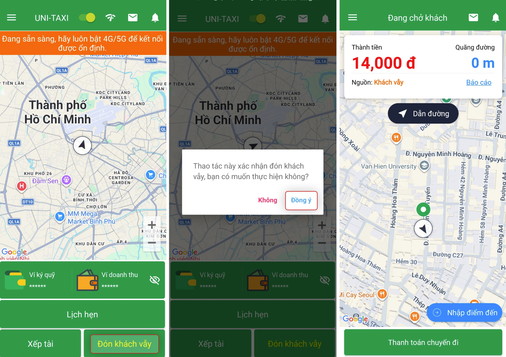
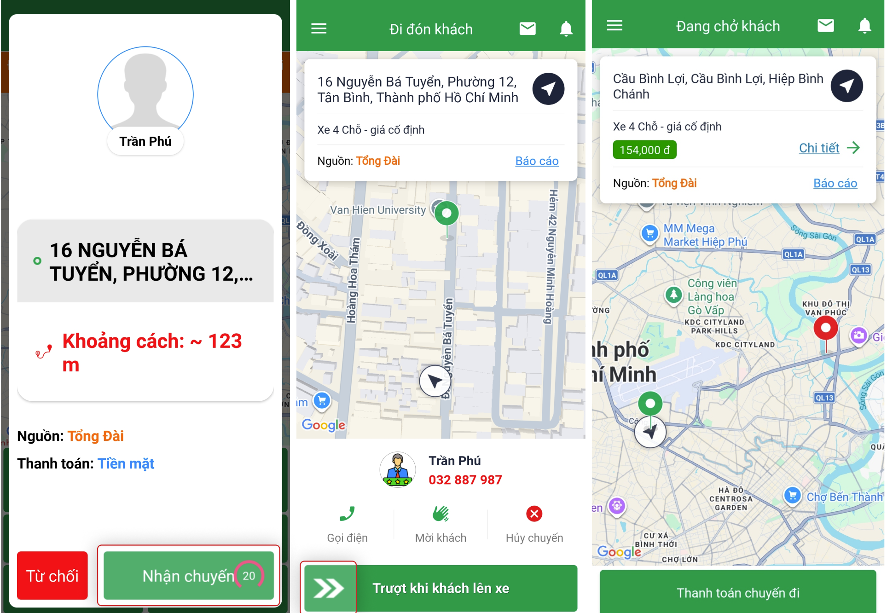
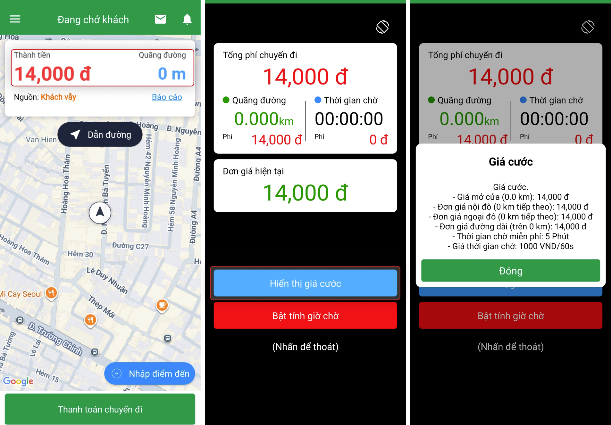
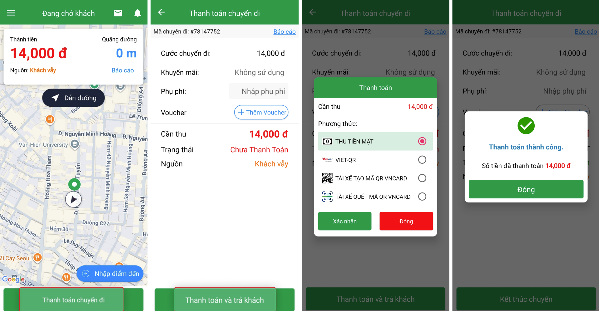
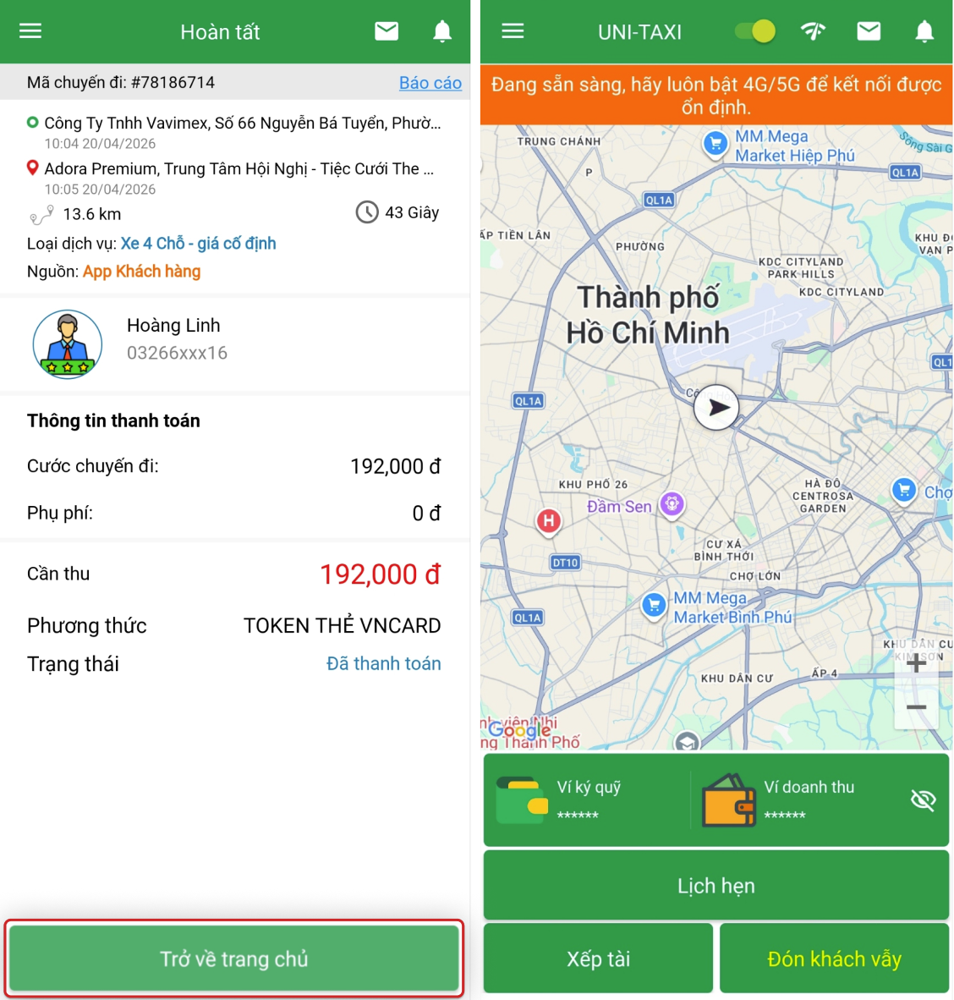

# Nhận & Xử lý chuyến

Hướng dẫn chi tiết cách nhận chuyến và xử lý các bước trong một chuyến đi.

## Trước khi bắt đầu

-   Đảm bảo **GPS** đã được bật (Luôn luôn).
-   Đảm bảo **kết nối Internet** ổn định.
-   App đang ở trạng thái **Online**.
-   Tắt tiết kiệm pin hoặc tối ưu pin cho VNDriver.

!!! warning "Quan trọng"
    Nếu GPS không hoạt động, bạn sẽ không nhận được chuyến. Kiểm tra biểu tượng GPS trên màn hình (phải có màu xanh).

## Đón khách vẫy

1. Trên màn hình chính, chọn **Khách vẫy**.

    {: loading=lazy }

2. Xác nhận cuốc khách vẫy để bắt đầu.

## Nhận khách từ tổng đài

Khi có chuyến đi được gửi từ tổng đài:

1. App hiển thị thông tin chuyến: điểm đón, điểm đến, khoảng cách, giá cước.

    {: loading=lazy }

2. Chọn **Nhận chuyến** để nhận.

!!! tip "Mẹo"
    Giữ điện thoại ở chế độ không khóa màn hình và âm lượng đủ nghe để không bỏ lỡ chuyến.

## Giao diện đi đón khách

Khi đang di chuyển đến điểm đón, màn hình hiển thị các tiện ích:

- **{: width=32 } Gọi khách** — Thao tác nhanh gọi cho khách hàng thông qua số điện thoại đã gọi lên tổng đài.

- **{: width=32 } Chỉ đường** — Liên kết mở ứng dụng Google Maps để xem đường đi đến vị trí đón khách.

- **{: width=32 } Hủy chuyến** — Trường hợp không đón được khách hoặc đón nhầm khách, có thể hủy chuyến.

## Đón khách

1. Khi đến điểm đón, trượt **Khách lên xe** để bắt đầu chở khách.

    {: loading=lazy }

2. App chuyển sang giao diện đồng hồ điện tử theo GPS.

    {: loading=lazy }

## Thanh toán & Kết thúc chuyến

1. Khi đến điểm trả khách, chọn **Thanh toán**.

    {: loading=lazy }

2. Sau khi thanh toán thành công, chọn **Kết thúc chuyến**.

    {: loading=lazy }

3. Quay lại màn hình sẵn sàng đón khách để nhận cuốc mới.

## Xử lý lỗi GPS

!!! failure "Không tìm thấy vị trí / GPS không hoạt động"

    - Kiểm tra đã bật GPS trên điện thoại.
    - Di chuyển ra khỏi khu vực có nhiều nhà cao tầng/hầm.
    - Tắt và bật lại GPS.
    - Khởi động lại App.
    - Nếu vẫn lỗi, khởi động lại điện thoại.
