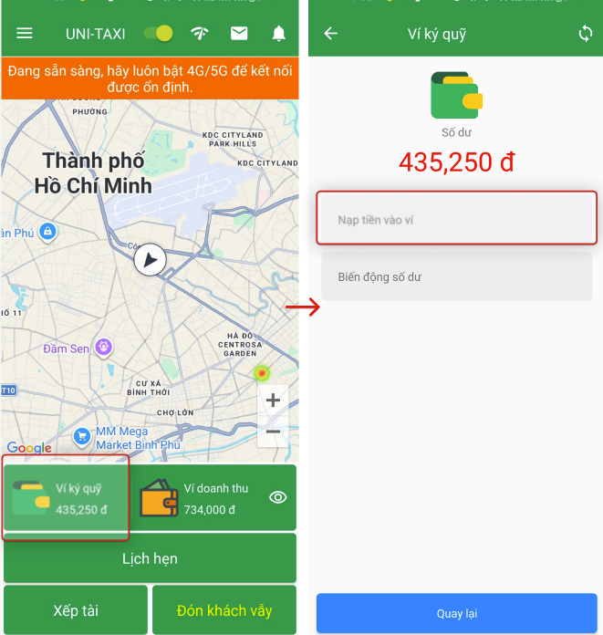
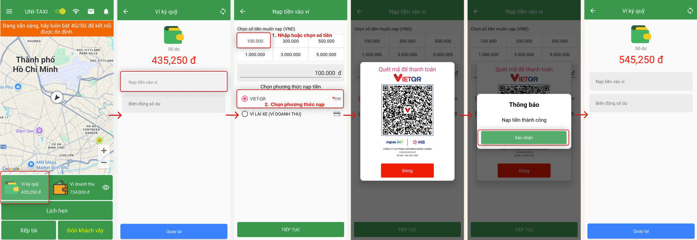
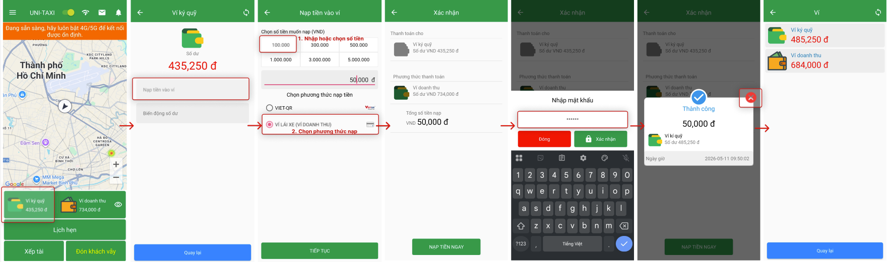

# Ví ký quỹ & Thanh toán

Quản lý ví ký quỹ, nạp tiền và xem lịch sử giao dịch.

## Xem ví ký quỹ

Tài xế có thể xem ví ký quỹ tại màn hình trang chủ:

{: loading=lazy }

| Mục | Mô tả |
|---|---|
| **Số dư hiện tại** | Số tiền hiện có trong ví ký quỹ |
| **Số dư khả dụng** | Số tiền có thể sử dụng |

## Nạp tiền vào ví ký quỹ

Tài xế có thể nạp tiền ví ký quỹ theo **2 phương thức**:

### Phương thức 1: Thanh toán bằng mã QR

{: loading=lazy }

1. Chọn **Nạp tiền** → **Thanh toán bằng mã QR**.
2. Quét mã QR để thanh toán.
3. Xác nhận giao dịch.

### Phương thức 2: Nạp từ ví doanh thu

{: loading=lazy }

1. Chọn **Nạp tiền** → **Từ ví doanh thu**.
2. Nhập số tiền muốn nạp.
3. Xác nhận chuyển tiền.

## Lịch sử giao dịch

Xem chi tiết các giao dịch đã thực hiện:

| Loại | Mô tả |
|---|---|
| **Nạp tiền** | Các lần nạp vào ví ký quỹ |
| **Trừ phí** | Các khoản phí sử dụng dịch vụ |
| **Điều chỉnh** | Cộng/trừ từ hỗ trợ hoặc điều chỉnh hệ thống |

1. Chọn **Lịch sử** trong mục Ví.
2. Xem danh sách giao dịch theo ngày.
3. Chọn một giao dịch để xem chi tiết.

## Rút tiền

### Điều kiện

-   Số dư tối thiểu để rút: **50,000 VND**
-   Số dư khả dụng ≥ số tiền muốn rút

### Các bước rút tiền

1. Chọn **Rút tiền** trong mục Ví.
2. Nhập **số tiền** muốn rút.
3. Chọn **tài khoản ngân hàng** đích (hoặc thêm tài khoản mới).
4. Xác nhận thông tin.
5. Chọn **Xác nhận rút tiền**.
6. Chờ xử lý (thời gian tùy theo ngân hàng).

### Quản lý tài khoản ngân hàng

1. Chọn **Quản lý tài khoản ngân hàng**.
2. Chọn **Thêm tài khoản**:
    -   Tên ngân hàng
    -   Số tài khoản
    -   Chủ tài khoản
3. Lưu thông tin.

!!! warning "Lưu ý"
    -   Kiểm tra kỹ thông tin tài khoản ngân hàng trước khi rút tiền.
    -   Sai thông tin tài khoản có thể dẫn đến mất tiền.
    -   Thời gian nhận tiền: 1-3 ngày làm việc tùy ngân hàng.
